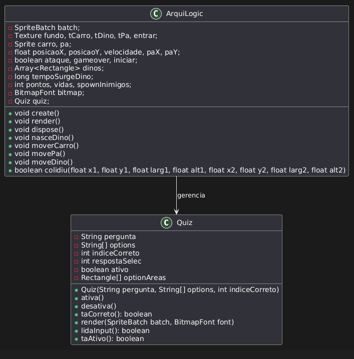

# 🛻🦖 ArquioLogic 🦖🛻

## Sobre o Jogo
**ArquioLogic** é um jogo interativo no qual o jogador precisa sobreviver enquanto enfrenta dinossauros que vêm em sua direção. Inspirado nos clássicos jogos de nave espacial, o diferencial é a necessidade de responder a perguntas de um quiz após ser derrotado para retornar ao jogo.

---

## Autoria
- **Autor:** Weslley H. de B. Menezes  
- **Curso:** Sistemas de Informação - Universidade Federal de Santa Maria (UFSM)

---

## Comentários sobre o Processo de Desenvolvimento

### Planejamento e Ideia
O desenvolvimento começou com a ideia de criar um escape room. No entanto, devido a imprevistos, decidi por um jogo mais simples e intuitivo.

### Tecnologias Utilizadas
- **Linguagem:** Java  
- **Framework:** LibGDX  
- **IDE:** VSCode  
- **Controle de Versão:** Git e GitHub  

### Desafios Encontrados
1. **Renderização de Textos:**  
   Encontrei problemas na compilação da versão HTML devido à biblioteca de fontes. Resolvi utilizando a `BitmapFont`.
2. **Implementação do Quiz:**  
   Houve dificuldades em integrar o quiz ao jogo, especialmente ao condicionar a continuidade do jogo à resposta correta.
3. **Sobrescrita de Código:**  
   Durante a implementação avançada, acidentalmente sobrescrevi meu código do quiz e precisei reescrevê-lo do zero.
4. **Paradas do Jogo:**  
   Configurar a lógica para início e fim do jogo foi desafiador por exigir um controle rigoroso.
5. **Exploração da LibGDX:**  
   Achar os comandos corretos e lidar com conflitos de imports consumiu tempo, mas foi superado com pesquisa e prática.

---

.

## Estrutura do Projeto

### **Arquiolog**
- Gerencia as telas (`MenuScreen`, `GameScreen`, `VictoryScreen`, `GameOverScreen`).
- Métodos principais:
  - `startGame()`
  - `decrementLives()`
  - `incrementCorrectAnswers()`

### **GameScreen**
- **Componentes Utilizados:**
  - `Dino`: Lida com movimentação e colisão dos dinossauros.
  - `InteractiveObjectManager`: Gerencia os objetos interativos.
  - `QuizManager`: Administra o quiz.
  - `GameRenderer`: Renderiza o estado do jogo.
- **Integrações com `Arquiolog`:**
  - Ajusta vidas e controla progresso do jogo.

---

## Referências
1. **Material da disciplina:** [GitHub da ELC117](https://github.com/andreaInfUFSM/elc117-2024b)  
2. **Documentação da LibGDX:** [libgdx.com](https://libgdx.com/dev/)  
3. **Inspirações e tutoriais:**  
   - [Canal Terminal Root](https://www.youtube.com/watch?v=2bmvlwvnirk)  
   - Sprites gerados por IA ([ChatGPT](https://chatgpt.com/g/g-pmuQfob8d-image-generator))  
4. **Quiz:** Baseado no material do curso e vídeos do canal Terminal Root.

---
